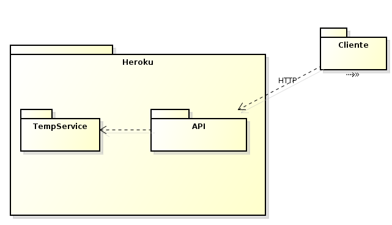

# ArswParcialFinal
== Author
Julian Mateo Guzman Diaz

# Heroku link
https://arswparcfinal.herokuapp.com/ .[Heroku app]

#Arquitectura
usa un servicio simple para calcular temperaturas por medio de un api que obtiene la temperatura y luego procede a usar las clases de temperature para hacer las dos conversiones posibles

